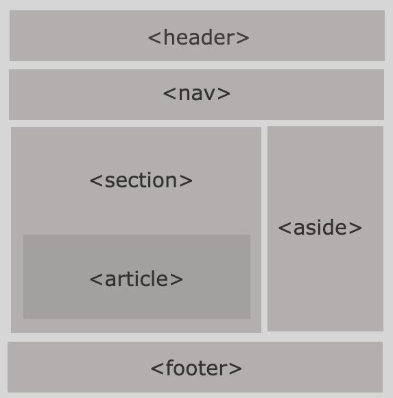

[TOC]


## HTML

> Hyper Text Markup Language

하이퍼 텍스트(참조)를 이용해 한 문서에서 다른 문서로 이동할 수 있도록 다중으로 연결된 텍스트

ex) http(hyper text transfer protocol), html(hyper text markup language)


**how to make HTML**

1. html 파일을 만든다
2. `!` + `tab`으로 기본 outline을 만든다
3. bootstrap이나 다른 것들을 받아 쓰기 위해 <head>에 <link href="~~">를 넣어주고, <body> 끝부분에 `<script src="~~">를 넣어준다


**HTML 구성요소**

- <html></html> : 페이지 전체를 감싸며 not요소라 불림

- <head></head> : html에 포함되어 있는 모든 것의 컨테이너

  keywords & 검색결과에 표시되기를 원하는 메시지 설명, CSS...

- <body></body> : 웹에서 보여주고자 하는 것

- <meta charset="utf-8"> : 문서가 사용해야 할 문서 집합을 utf-8로 설정


**요소(element/tag)**

- HTML은 시작태그와 종료태그, 그 사이에 들어가는 내용으로 구성된다.
- 요소(tag)는 중복하여 사용 가능하다.


**속성(attribute)**

- 속성은 태그의 부가적인 정보가 들어온다.
- 요소는 속성을 가질 수 있으며, 요소에 추가적 정보(이미지 파일의 경로, 크기 등)을 제공한다.
- 태그와 상관없이 사용 가능한 속성들(html global attribute)도 있다.


**Semantic tag**

태그를 통해 해당 부분이 어떠한 역할을 하는지 쉽게 구분할 수 있다

semantic tag의 종류는 다음과 같다.

```html
<header></header> : 머리글을 지정해준다 (주로 위쪽에 삽입)
<nav></nav> : 문서에서 다른 문서로 연결해주는 링크의 모음으로 구성되어 있다(네비게이션)
<section></section> : 주제별 콘텐츠 영역을 나타낸다
<article></article> : 컨텐츠의 실제 내용을 포함하는 영역이다
<aside></aside> : 사이드 바 영역이다
<footer></footer> : 가장 하단에 위치하며, 주로 제작자, 저작권, 회사소개 등의 정보를 나타낸다
```




- 장점

  1. 읽기 쉽다

     개발자가 의도한 요소의 의미가 명확하다. 코드의 **가독성** 높이고, **유지보수**가 쉽다.

  2. 접근성이 좋아진다(검색엔진 및 보조기술 --> 시각장애우용 스크린리더 --> 더 나은 경험 제공)

     검색엔진은 HTML코드만 잘 읽는다. 따라서 의미가 구분되어있는 semantic tag를 이용해 검색엔진이 웹 페이지를 더 잘 읽고 이해할 수 있도록 해준다.


**cf) semantic web**

> 웹에 존재하는 수만은 웹페이지들에 메타데이터를 부여하여, 기존의 단순한 데이터 집합이었던 웹페이지를 '의미'와 '관련성'을 가지는 거대한 데이터베이스로 구축하고자 하는 발상


**태그의 세부요소들**

`<label>`의 `for`는 `<input>`과 `<select>`등 다른 태그들의 `id`요소와 값이 연동시킬 수 있다.

이 경우 화면에 표시되는 label의 값을 누르면 input이나 select가 선택된다.

```html
<input type="radio" name="sandwich" id="food" value="egg">
<label for="food">subway sandwich</label>
```

위의 경우 화면에 표시되는 `subway sandwich`를 누르면 `input`의 값이 선택된다.


## 	CSS

**HTML문서에 CSS를 더하는 방법(3가지)**

1. Inline에 써주기

2. internal(`<head>`내부에 `<style>`태그 내부에 선택자 만들기)

3. external(`<link>` 태그 사용해서 외부의 css파일 불러오기)

   > bootstrap 때 사용함


**선택자 및 결합자**

1. `*` : 전체 선택자
2. `h2` : 요소 선택자(이와 같이 요소들을 사용하면 해당 요소들을 사용할 때마다 적용됨)
3. `.` : 클래스 선택자
4. `#` : id 선택자
5. .box `>` p : 자식 결합자 --> box 아래 자식 항목 중 맨 처음 p 항목
6. .box p : 자손 결합자 --> box 아래 자식 항목 중 전체 p항목
7. p `~` span : 일반 형제 결합자 --> p 뒤에 오는 span에 영향( 꼭 붙어있을 필요 없고, 여러개에 적용가능)
8. p `+` p : 인접 형제 결합자 --> p 요소 중 p 바로 뒤에 나오는 p에 영향


- 심화

  ```html
  <div id="programming">
      <h2>몇번이 해당될까??</h2>
      <p>1</p>
      <p>2</p>
      <p>3</p>
      <p>4</p>
  </div>
  ```

  ```html
  #programming > p:nth-child(2) {
  	color: red;
  }
  ```

  결과는 `1`이 빨간색으로 나온다!!

  `()`안에 있는 숫자에 해당하는 요소가 p인 경우에 영향을 준다.

  ```html
  #programming > p:nth-of_type(2) {
  	color: blue;
  }
  ```

  결과는 `2`가 파란색으로 나온다!!

  요소가 p인 것들 중에서 `()`안에 있는 숫자에 해당하는 순서에 해당하는 것에 영향을 준다.


**우선순위**

1. !important
2. Inline
3. id 선택자 (`#`으로 만듬)
4. 클래스 선택자(`.`으로 만듬)

5. 요소 선택자
6. 소스문서


**상대 단위 크기**

\* em : 상위 요소 크기의 몇배로 할지 나타냄

\* rem : root + em 이란 뜻으로 문서의 최상위 요소(html태그) 폰트 사이즈의 몇배로 할지 나타냄


**display 속성**

- display : block ==> 양 옆으로 공간을 다 차지한다. 줄바꿈 발생

- display : inline ==> 주어진 공간만 차지(옆에 다른 요소 올 수 있음) 줄바꿈 발생하지 않음

  > ex) <span> <a>

- display : flex ==> CSS flexible 사용

  > flex-direction: ~~  /  justify-content: flex-~~~  /  align-items: ~~  /  flex-wrap 등... 
  
   [flexible box](#css-flexible-box-layout-module) **참조(중요한 파트)**


**display : none & visibility : hidden**

속성 값을 통해 단순히 안보이게 하거나, 또는 없앨 수 있다.

\* display : none ==> 코드는 존재하나, 화면에서는 존재하지 않는다.

\* visibility : hidden ==> 화면에 보이지는 않으나, 위치한 자리가 비어있는 상태로 나온다. 다른 요소들이 차지할 수 없다.


**block요소**

margin : 0 auto; 좌우 중앙 정렬


**css 파일 내 class 속성 지정**

line-height: ~~px;  ==> 문자열 행간 조정


## CSS Box model


실제로 우리가 볼 수 있는 영역은 `padding`까지 이다.


## CSS Box position

**position**

1. position : static ==> 디폴트 값(기준위치); 왼쪽 상단

2. position: relative ==> **static 위치를 기준**으로 (상대위치)

   > 코드 순서대로 쌓이나 먼저 쓰인 코드가 자리를 비우면, 아래에 코드로 작성된 박스가 올라와서 자리를 차지한다.

3. position : absolute ==> static이 아닌 **보무/조상 요소 기준**으로 이동

   > 코드 순서대로 쌓이고, 먼저 쓰인 코드가 자리를 비워도, 아래에 코드로 작성된 박스가 올라오지 못한다. 
   >
   > 자신이 원래 있던 자리를 비우지 않고 still 점령중임

4. position : fixed ==> 부모 요소 상관 없이, 단순히 브라우저에서 어디에 위치하는가


## float

> 사실 float는 요즘에는 잘 쓰이지 않는다. mdn에서도 legacy로 분류해 놓음

how to make float

```html
ex)
.left {
	float:left;
}
```

clearfiix::after

```html
.clearfix::after {
	content: "";
	display: block;
	clear: both;
}
```

how to use clearfix

```html
<body>
    <header class="clearfix">
        <div class="box1 left">box1 div</div>
    </header>
    <div class="box2">div</div>
</body>
```


## CSS flexible box layout module

##### 구조

기본적으로 `flex container(부모요소)`로 각 `flex items(자식요소)`를 컨트롤 한다.

main axis를 기준 왼쪽에서 오른쪽으로 items가 쌓인다.

main axis는 바뀔 수 있다.

main&cross axis(row : 좌 --> 우, cross : 위 --> 아래) ==> flexbox는 (1차원)단방향 레이아웃

```html
.flex ~~ {
	display: flex   (or)   inline-flex
}
```

> 정렬한 태그 중 부모태그의 클래스에 넣어줘야 함


##### 사용방법

> content : 여러줄, items : 한줄, self : 각각 items의 개별 요소

1. `flex-direction` : 배치 방향 설정(main 축 바꾸기 : 가로 or 세로)
   - `row` / `row-reverse` & `column` / `column-reverse`

2. justify-content : 메인축 방향 정렬
   - `flex-start`(default) / `flex-end` / `center` / `space-between` / `space-around` / `space-evenly`
3. align-items, align-self, align-content : 교차축 방향 정렬
   - `flex-start` / `flex-end` / `center` / `space-between` / `space-around` / `space-evenly` / `stretch`**(default)**

- 예외) align-self 는 값이 조금 다르다!!
  - `flex-start` / `flex-end` / `center` / `auto` / `baseline` / `stretch`


\* 기타

1.  `order` : 숫자로 순서를 나타낸다.
   -  default = 0, -1이면 앞으로, 1이면 뒤로 보낸다
2. `flew-grow` : 주축에서 남은 공간을 각 항목에 분배
   - default = 0 / 음수 불가능
3. `flew-flow` : `flew-direction`과 `flew-wrap`을 같이 사용
   - flew-flow : column wrap 
4. `flew-wrap` : 요소들의 정렬 방법을 표시
   - default = nowrap : 요소들을 한줄에 정렬 / wrap : 요소들이 범위를 벗어나면 여러줄에 걸쳐 정렬


## Bootstrap

> javascript의 library / responsive grid system

우선, front-end 개발시 CSS 초기화 후 진행(각 브라우저마다 기본 설정이 다름)

- 요즘은 reset보다는 normalize를 선호함


**how to use bootstrap**

bootstrap은 <head>내부에 <title>위 <link href="~~"> 로 넣어줌 ==> css

bootstrap.bundle은 <body>내부에 <script src="~~">로 넣어줌 ==> js


- CDN : Content Delivery(Distribution) Network

  > 컨텐츠(CSS, JS, Image, Text 등)을 효율적으로 전달하기 위해 여러 노드를 가진 네트워크에 데이터를 제공하는 시스템

  개별 end-user의 가까운 서버를 통해 빠르게 전달 가능(지리적 이점) / 외부 서버를 활용함으로써 본인 서버의 부하 적어짐

- CSS 파일 내부에 `.`으로 정의된 클래스들은 규칙을 가지고 있음 : 문서 확인 필수적이고, 유추 가능


기본 class 값

m : margin

p : padding

-----------------

t : top

b : bottom

s : left (start)

e : right (end)

x : left-right

y : top-bottom

-------

0 : 0rem = 0px

1 : 0.25rem = 4px

2 : 0.5rem = 8px

3 : 1rem = 16px

4 : 1.5rem = 24px

5 : 3rem = 48px


text 색 바꾸기 : `.text-색이름`(정해져 있음)

\** 주의) bootstrap 내부에 있는 `flex`는 이름이 조금씩 다르다!!


## Grid system

1. 12개의 column
2. 6개의 grid breakpoints

##### 구조

`container` - `row` - `column`으로 배치

```html
<div class="container">
	<div class="row">
    	<div class="col"></div>
		<div class="col"></div>
        <div class="col"></div>
    </div>
</div>
```

bootstrap홈페이지 - docs - grid option 에 나와 있다.

cf)  d-sm-none : display가 sm(576)이 넘어가면 none

​	  d-md-block : display가 md(768)이 넘어가면 block


* flex요소를 사용하고 싶을 때

```html
<div class="container">
	<div class="row justify-content-center(start/end) align-items-center(start/end)">
    	<div class="col align-self-start(center/end)"></div>
		<div class="col"></div>
        <div class="col"></div>
    </div>
</div>
```

`align-self-~~ `외에는 전부 `row`옆에 써서 flex정렬을 해준다!!


* Nesting(중첩된 grid)

  grid 내에 grid


- offset : 시작점 조정 가능

  offset - #(숫자) : #(숫자)만큼 남기고 생성


#### Bootstrap 에 유용한 사이트

- 폰트
  1. google font : [](https://fonts.google.com/)
  2. font awesome : [](https://fontawesome.com/)
- animation
  1. [](https://animate.style/)


